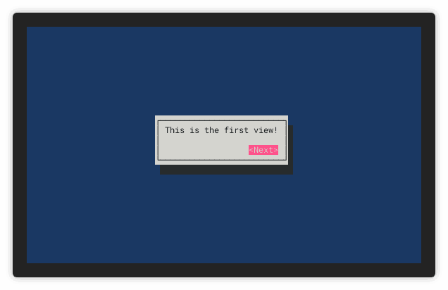

<h1 align="center">Welcome to cursive-tabs 👋</h1>
<p align="center">
  <a href="https://travis-ci.org/deinstapel/cursive-tabs">
    
  </a>
  <a href="https://travis-ci.org/deinstapel/cursive-tabs">
    
  </a>
  <a href="https://crates.io/crates/cursive-tabs">
    
  </a>
  <a href="https://docs.rs/cursive-tabs">
    
  </a>
  <a href="https://github.com/deinstapel/cursive-tabs/blob/master/LICENSE">
    
  </a>
  <a href="http://spacemacs.org">
    
  </a>
  <a href="http://makeapullrequest.com">
    
  </a>
  <br>
  <i>A tab view wrapper for
  <a href="https://github.com/gyscos/cursive">gyscos/cursive</a>
  views</i>
</p>

---

> This project is work-in-progress

This project provides a wrapper view to be able to easily handle multiple tabs that can be switched to at any time without having to change the order of the views for [gyscos/cursive](https://github.com/gyscos/cursive) views.

## How does it look like? `demo` [](https://github.com/faressoft/terminalizer)

<details>
  <summary>Expand to view</summary>
  
</details>

## Usage

Simply add to your `Cargo.toml`

```toml
[dependencies]
cursive-tabs = "^0"
```

### Creating a `TabPanel`

The easiest way to use this crate is by creating a `TabPanel` and add your views to it.
In the `TabPanel` included is a bar that shows all tabs and allows to switch between them by clicking the desired tab. 
Below it is the `TabView` showing the current tab.

It can be created by simply calling new on `TabPanel` and views and customize it as you want, have a look at the [documentation](https://docs.rs/cursive-tabs) to see all options.

```rust
use cursive::TextView;
use cursive_tabs::TabPanel;

let mut siv = cursive::default();

//Create your panel and add tabs
let mut panel = TabPanel::new()
    .with_tab("First", TextView::new("This is the first view!"))
    .with_tab("Second", TextView::new("This is the second view!"));
siv.add_layer(panel);
siv.run();
```

### Creating a `TabView`

This crate also provides a struct `TabView` you can use to add tabs and switch between them, if you do not need a separate bar to switch and e.g. want to switch programmatically.

The `TabView` can also be used to create your own Panel/Bar if you want to design your cursive environment a different way.

```rust
use cursive::{views::TextView};
use cursive_tabs::TabView;

let mut siv = cursive::default();
let tabs = TabView::new().with_tab(0, TextView::new("Our first tab!"));
// We can continue to add as many tabs as we want!

siv.add_layer(tabs);
siv.run();
```

Look into the [documentation](https://docs.rs/cursive-tabs) for more examples and a detailed explanation.

### Creating your own Panel :hammer::construction:

When you create a `TabBar` it will more or less look similar to the view e.g. also used in the example. To customize it you then need to create a view, creating a `TabBar` and a `TabView` events between them can be exchanged e.g. with channels.
Channels have been chosen in this case by us, because they provide the easiest way to communicate between to instances of views in cursive.

To make these channels work you have to create two separate channels transmitting both keys, once for the direction from the bar to the tab view, transmitting keys that have been selected by e.g. buttons, and the other from the tab view to the bar.

An example for such a button would look like this.
```rust 
let button_tx_clone = button_tx.clone();
let button = Button::new_raw(format!(" {} ", key), move |_| {
                match button_tx_clone.send(key) {
                    Ok(_) => {}
                    Err(err) => {
                        debug!("button could not send key: {:?}", err);
                    }
                }
            });
```

To make the `TabView` respond to messages over this channel pass the receiving end to the tab view via the method `set_bar_rx`.

The other direction can be set by passing the Sender to `TabView` via the method `set_active_key_tx`. In this channel the currently active is send everytime a switch between tabs occurs. You can use this to register switches in your tab bar.

The rest is depending on how you want to style your panel, but if you have anymore questions or problems have a look at the source of the provided `TabPanel`.
 
## Troubleshooting

If you find any bugs/unexpected behaviour or you have a proposition for future changes open an issue describing the current behaviour and what you expected.

## Development [](https://travis-ci.org/deinstapel/cursive-tabs) [](https://github.com/fin-ger/shellshot)

### Running the tests

> The tests will no longer kill your tmux server. As the tests have moved to use cursive exclusively in combination with [insta](https://crates.io/crates/insta)

#### Running all test suites

Just run

```
$ cargo test
```

to execute all available tests.

#### Investigating failed tests

In case some test fails with your changes, you can use the `cargo-insta` tool to investigate the test case.

To install
```
$ cargo install cargo-insta
```

and to run the tests and investigate all failing tests interactively.

```
$ cargo insta review
```

Any changes between the expected and received screen will be then displayed.

#### shields.io endpoints

[shields.io](https://shields.io) endpoints are generated inside the `./target/shields` folder. They are used in this README.

### Public API naming

The current public API of this crate is not consistent with [RFC 344](https://github.com/rust-lang/rfcs/pull/344). This is due to `cursive` itself not being
consistent with `RFC 344`. This crate tries to implement a smooth user experience for cursive
users. Therefore, the `cursive` naming convention was adapted. When `cursive` upstream converts
their API to a `RFC 344` consistent naming scheme, this crate will adapt to the changes.

## Authors

**Fin Christensen**

> [:octocat: `@fin-ger`](https://github.com/fin-ger)  
> [:elephant: `@fin_ger@weirder.earth`](https://weirder.earth/@fin_ger)  
> [:bird: `@fin_ger_github`](https://twitter.com/fin_ger_github)  

<br>

**Johannes Wünsche**

> [:octocat: `@jwuensche`](https://github.com/jwuensche)  
> [:elephant: `@fredowald@mastodon.social`](https://mastodon.social/web/accounts/843376)  
> [:bird: `@Fredowald`](https://twitter.com/fredowald)  

## Show your support

Give a :star: if this project helped you!
